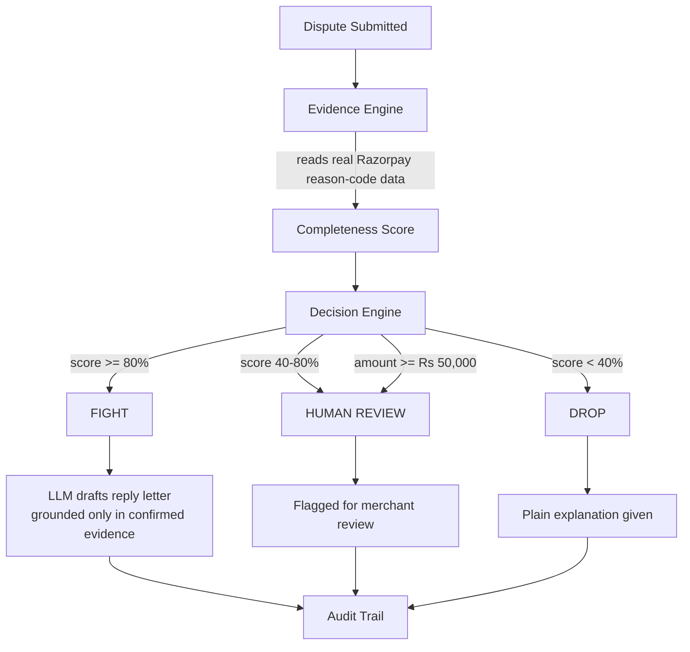
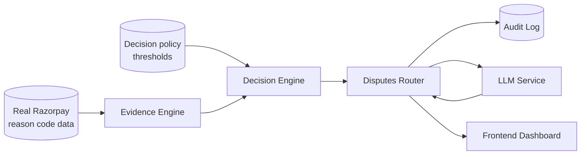
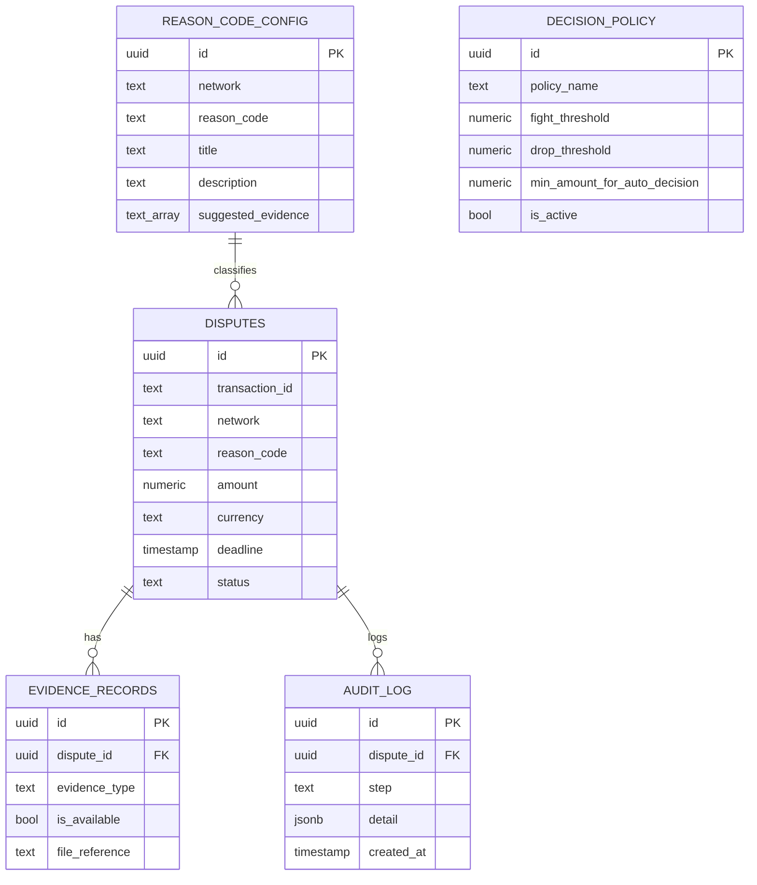

<div align="center">

# 🛡️ Dispute-Desk

**AI-assisted dispute decision system for merchants — tells you honestly whether to fight a chargeback, and shows its work.**

Built for **Razorpay AI Buildathon 2026** — Track 02: AI Risk Manager

    

</div>

---

## Table of Contents

- [Overview](#overview)
- [Architecture](#architecture)
- [Data Flow](#data-flow)
- [Modules](#modules)
- [API Endpoints](#api-endpoints)
- [Database Schema](#database-schema)
- [Quick Start](#quick-start)
- [Repository Structure](#repository-structure)
- [Assumptions & Known Limitations](#assumptions--known-limitations)

---

## Overview

When a customer disputes a payment, Razorpay already gives merchants a dashboard to view the dispute and upload evidence. What's missing is the layer that actually **thinks** for the merchant — nobody tells them, honestly, whether a dispute is even worth fighting.

Dispute-Desk is a decision-support system, not a chargeback-writing chatbot. Given a disputed transaction, it identifies the real evidence required for that dispute's reason code (sourced from Razorpay's own published documentation), checks what the merchant actually has, and returns one of three honest verdicts — **Fight / Drop / Human Review** — with a plain-language reason. If it's worth fighting, an LLM drafts a reply letter strictly grounded in the confirmed evidence. Every step is logged to a full audit trail.

**Core principle:** the system is built to be honest, not to maximize wins. It will actively recommend dropping a weak case.

---

## Architecture



The LLM never makes the fight/drop/review decision — that's done by a deterministic, policy-driven rules engine. The LLM's only job is drafting text, strictly grounded in evidence the engine already confirmed exists.

---

## Data Flow



| Step | Module | Input | Output | Description |
|---|---|---|---|---|
| 1 | Evidence Engine | Dispute network + reason code + available evidence | Completeness score, missing evidence list | Looks up real required evidence for this reason code, compares against what's available |
| 2 | Decision Engine | Completeness score + amount + policy | Verdict: FIGHT / DROP / HUMAN_REVIEW | Deterministic, policy-driven — no black box |
| 3 | Audit Service | Every step's output | Logged rows in `audit_log` | Full traceable history per dispute |
| 4 | LLM Service | Confirmed evidence only (if verdict = FIGHT) | Drafted reply letter | Grounded strictly in real evidence, nothing invented |
| 5 | Disputes Router | All of the above | Single API response | Orchestrates the full flow end-to-end |

---

## Modules

### `app/data/` — Real Dispute Data & Synthetic Evaluation Set

| | |
|---|---|
| **Purpose** | Seed the database with real Razorpay dispute reason codes and generate a labeled synthetic dataset for evaluation |
| **Tech** | Python, Supabase client |
| **Entry point** | `python -m app.data.seed_reason_codes` |
| **Key files** | `seed_reason_codes.py` → `seed_decision_policy.py` → `synthetic_generator.py` |
| **Output** | 38 real reason codes across UPI/Visa/Mastercard/RuPay/Amex seeded into `reason_code_config` |

### `app/services/evidence_engine.py` — Evidence Completeness Scoring

| | |
|---|---|
| **Purpose** | Deterministically score how complete a dispute's evidence is, against real requirements |
| **Tech** | Python, Supabase |
| **Key logic** | `assess(network, reason_code, available_evidence) -> completeness_score` |
| **Output** | Completeness %, missing evidence list |

### `app/services/decision_engine.py` — Fight / Drop / Review Logic

| | |
|---|---|
| **Purpose** | Turn the evidence score into an honest, explainable verdict |
| **Tech** | Python, policy data from Supabase (no hardcoded thresholds) |
| **Key logic** | `decide(network, reason_code, available_evidence, amount) -> verdict + reason` |
| **Design note** | High-value disputes are always forced to HUMAN_REVIEW regardless of evidence score — the system doesn't let itself auto-decide high-stakes cases alone |

### `app/services/audit_service.py` — Audit Trail

| | |
|---|---|
| **Purpose** | Log every decision step so the full reasoning path is retrievable per dispute |
| **Tech** | Python, Supabase |
| **Output** | Ordered `audit_log` rows: `dispute_created` → `evidence_recorded` → `verdict_computed` → `letter_drafted` |

### `app/services/llm_service.py` — Grounded Letter Drafting

| | |
|---|---|
| **Purpose** | Draft a dispute reply letter, strictly constrained to confirmed evidence |
| **Tech** | Groq API, `openai/gpt-oss-120b` |
| **Design note** | The LLM is explicitly prompted not to reference or imply any evidence beyond what's confirmed available — it never makes the fight/drop decision itself |

### `app/routers/disputes.py` — API Layer

| | |
|---|---|
| **Purpose** | Ties Evidence Engine + Decision Engine + Audit Trail + LLM into one real end-to-end flow |
| **Tech** | FastAPI |
| **Entry point** | `uvicorn app.main:app --reload --port 8000` |
| **Docs** | `http://localhost:8000/docs` (Swagger UI) |

### `frontend/` — Merchant Dashboard

| | |
|---|---|
| **Purpose** | Simple, plain-language dashboard for a non-technical shop owner to see disputes and act on them |
| **Tech** | React, Vite, Tailwind |
| **Key screens** | Landing → How It Works → My Disputes → Dispute Detail → Needs My Attention |

---

## API Endpoints

| Method | Endpoint | Description |
|---|---|---|
| GET | `/` | Health check |
| GET | `/synthetic-dataset?count=N` | Generate N labeled synthetic disputes for testing/evaluation |
| GET | `/evidence-assessment/{network}/{reason_code}?available=...` | Test the Evidence Engine directly |
| GET | `/decision/{network}/{reason_code}?amount=&available=` | Test the Decision Engine directly |
| POST | `/disputes/` | Create a real dispute — runs the full pipeline (evidence → decision → audit → LLM draft if FIGHT) |
| GET | `/disputes/{dispute_id}/audit-trail` | Retrieve the full audit trail for a dispute |

---

## Database Schema



---

## Quick Start

### Prerequisites

- Python 3.13+
- Node.js 18+
- A Supabase project (free tier)
- A Groq API key (free tier)

### 1. Clone & set up the backend

```bash
git clone https://github.com/shreeja99/Dispute-Desk.git
cd Dispute-Desk/backend
pip install -r requirements.txt
```

### 2. Environment variables

```bash
cp .env.example .env
# fill in SUPABASE_URL, SUPABASE_KEY, GROQ_API_KEY
```

### 3. Set up the database

Run the SQL in `schema.sql` (or the SQL blocks in this README's [Database Schema](#database-schema) section) in your Supabase SQL editor to create the four tables.

### 4. Seed real data

```bash
python -m app.data.seed_reason_codes
python -m app.data.seed_decision_policy
```

### 5. Start the backend

```bash
uvicorn app.main:app --reload --port 8000
# -> API at http://127.0.0.1:8000
# -> Swagger docs at http://127.0.0.1:8000/docs
```

### 6. Start the frontend

```bash
cd ../frontend
npm install
npm run dev
# -> Dashboard at http://localhost:5173
```

---

## Repository Structure

```
Dispute-Desk/
├── backend/
│   ├── app/
│   │   ├── main.py                  # FastAPI app entry point
│   │   ├── config.py                # Environment config
│   │   ├── db.py                    # Supabase client
│   │   ├── models/
│   │   │   └── schemas.py           # Pydantic request/response models
│   │   ├── data/
│   │   │   ├── seed_reason_codes.py     # Real Razorpay dispute data (38 codes)
│   │   │   ├── seed_decision_policy.py  # Decision thresholds
│   │   │   └── synthetic_generator.py   # Labeled synthetic dataset
│   │   ├── services/
│   │   │   ├── evidence_engine.py   # Deterministic completeness scoring
│   │   │   ├── decision_engine.py   # Fight/Drop/Review logic
│   │   │   ├── audit_service.py     # Audit trail logging
│   │   │   └── llm_service.py       # Grounded letter drafting
│   │   └── routers/
│   │       └── disputes.py          # Main API endpoints
│   ├── requirements.txt
│   └── .env.example
│
├── frontend/                        # React dashboard
│   ├── src/
│   │   ├── App.jsx
│   │   ├── screens/
│   │   │   ├── Landing.jsx
│   │   │   ├── HowItWorks.jsx
│   │   │   ├── MyDisputes.jsx
│   │   │   ├── DisputeDetail.jsx
│   │   │   └── NeedsAttention.jsx
│   │   └── components/
│   └── package.json
│
├── DESIGN.md                        # Frontend design brief
├── README.md
└── .gitignore
```

---

## Evaluation

Run against **100 synthetic disputes** with known ground-truth labels (`GET /evaluate?count=100`):

| Metric | Result |
|---|---|
| Total cases | 100 |
| Auto-decided (Fight/Drop) | 56 |
| Sent to Human Review | 44 |
| **Accuracy on auto-decided cases** | **100%** |
| False-fight rate | 0% |
| False-drop rate | 0% |

> The system deliberately defers 44% of cases to human review — mostly disputes exceeding the ₹50,000 forced-review threshold, or with evidence completeness in the 40-80% uncertain zone. On the cases it *does* auto-decide, it was correct every time in this run. This reflects a conservative design choice: the system would rather say "I'm not sure" than guess wrong on a money decision — and that tradeoff (coverage vs. confidence) is itself a tunable policy value, not a fixed limit.
>
> ⚠️ All evaluation is run against a synthetic dataset — we don't have access to real Razorpay merchant data, and we say so upfront rather than hiding it.

---

## Assumptions & Known Limitations

| Area | Assumption | Impact |
|---|---|---|
| Evaluation data | All accuracy/precision metrics are run against a **synthetic dataset** with known ground-truth labels | No access to real Razorpay merchant data — stated upfront, never hidden |
| Decision thresholds | Fight ≥80%, Drop <40%, forced review ≥₹50,000 are reasonable starting assumptions | Not calibrated against real historical dispute outcomes — configurable, tunable with real data in production |
| Drafted letters | LLM output is a starting draft for merchant review | Not a guaranteed-win submission; merchant should review before sending |
| Evidence submission | Evidence upload/tracking is simulated in our system | Does not yet integrate with Razorpay's real dispute-evidence API |
| Row Level Security | Disabled on Supabase tables | Acceptable since all access goes through the backend's service role key; would be enabled for production |
| Learning loop | System does not currently learn from real outcomes | Listed as future work, not oversold as present capability |

---

Built for Razorpay AI Buildathon 2026