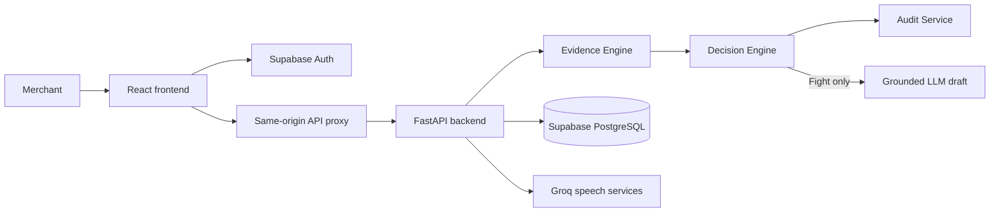

# Dispute-Desk Product Requirements Document

**Version:** 1.0  
**Date:** 2026-09-04  
**Product:** Dispute-Desk  
**Status:** Working product / demo-ready prototype
google sign in is not showing

## 1. Product Summary

Dispute-Desk is an AI-assisted payment-dispute decision system for merchants and small business owners. It turns a chargeback into a clear, evidence-based next action:

- **Fight** when the evidence is strong enough to contest.
- **Drop** when contesting is unlikely to succeed.
- **Human Review** when the case is uncertain or high value.

The product is deliberately conservative. It is a decision-support tool, not a promise of a successful chargeback and not a chatbot that automatically decides what the merchant should submit.

## 2. Problem

Payment disputes create three recurring problems for merchants:

1. A deadline can be missed while the merchant works out what happened.
2. Merchants often do not know which evidence is relevant to a specific network reason code.
3. Existing dashboards show case data but do not clearly explain whether fighting is worth the time and effort.

A merchant needs a fast, traceable answer: what happened, what proof exists, what is missing, and what action is justified.

## 3. Target Users

### Primary user: small business owner or merchant operator

- Handles payment disputes without a dedicated risk team.
- May not know banking, chargeback, or reason-code terminology.
- Needs concise recommendations and plain-language explanations.
- May prefer speaking instead of completing a form.

### Secondary user: finance or dispute operations team

- Reviews many disputes and prioritizes urgent or uncertain cases.
- Needs consistent policy decisions and an audit trail.
- Needs to inspect the evidence basis behind every recommendation.

## 4. Product Goals

- Reduce time from dispute arrival to an informed merchant action.
- Make evidence requirements specific to the payment network and reason code.
- Separate deterministic decision logic from generative AI.
- Make uncertainty visible instead of forcing a false yes/no answer.
- Provide a usable voice intake path for merchants who do not want to type.
- Preserve an audit trail for every important processing step.

## 5. Non-Goals

- Automatically submit evidence to Razorpay or a bank.
- Guarantee that a dispute will be won.
- Let an LLM decide Fight, Drop, or Human Review.
- Replace a merchant's final review or approval.
- Train a production fraud model from real merchant outcomes in the current version.

## 6. Core Value Proposition

**Dispute-Desk tells a merchant what to do with a payment dispute, why the recommendation was made, and which evidence supports it.**

Technical differentiators:

- Confidence-scored verdict engine.
- Reason-code evidence matrix.
- Voice and text intake pipeline.
- Policy thresholds stored as data, not hardcoded in the UI.
- Grounded reply drafting restricted to confirmed evidence.
- Full decision audit trail.

## 7. Product Principles

1. **Honesty over optimism:** recommend dropping weak cases and escalate uncertainty.
2. **Explainability:** expose completeness, missing evidence, thresholds, and reasoning.
3. **Deterministic decisions:** the Evidence Engine and Decision Engine own verdicts.
4. **Grounded generation:** the LLM may only use evidence already confirmed by the engine.
5. **Merchant control:** the merchant reviews drafts and makes the final call.
6. **Plain interaction:** use concise labels and tooltips for technical terms.
7. **Privacy-aware demo behavior:** synthetic disputes are used where real merchant data is unavailable.

## 8. Primary User Journeys

### Journey A: authenticated merchant reviews disputes

1. Merchant opens the homepage.
2. Merchant selects **Get Started**.
3. Merchant signs in with Google through Supabase OAuth.
4. Merchant arrives at **My Disputes**.
5. Disputes are sorted by days remaining to the response deadline.
6. Merchant filters by All, Fight, Drop, or Needs Review.
7. Merchant scans each card for verdict, amount, short reason, and days left.
8. Merchant opens a dispute detail page.
9. Merchant reviews reasoning, evidence completeness, missing items, and draft letter when available.
10. Merchant copies or edits the draft and decides what to submit externally.

### Journey B: guest demo

1. Merchant selects **Continue as guest (demo)** on the sign-in page.
2. The app stores a local demo marker and opens the dashboard.
3. The merchant can explore synthetic disputes and product workflows.
4. The account page identifies the session as **Guest account / Demo session**.
5. Guest logout removes the local demo marker and returns to sign-in.

A guest session intentionally has no email or password. It is not a registered account.

### Journey C: log a dispute by typing

1. Merchant opens **Log a Dispute**.
2. Merchant enters transaction reference, network, customer reason, amount, response date, and available proof.
3. Merchant reviews the captured details.
4. Merchant confirms the dispute.
5. Backend runs evidence assessment, verdict computation, audit logging, and conditional letter drafting.
6. The new result can be returned to the merchant's dispute list.

### Journey D: log a dispute by voice

1. Merchant selects **Say it**.
2. Merchant taps the microphone and describes the dispute.
3. Audio is transcribed through the voice API.
4. The conversational extraction service asks one short follow-up question when required information is missing.
5. The merchant answers by voice; the system can speak the question aloud.
6. Once network, reason code, amount, and evidence are sufficiently known, the system presents a confirmation form.
7. Merchant edits or confirms the extracted fields.
8. The standard dispute pipeline runs.

### Journey E: prioritize attention

1. Merchant opens **Needs My Attention**.
2. The page shows uncertain cases and cases with fewer than two days remaining.
3. Merchant opens the relevant detail page and decides whether to add evidence, review the draft, or accept the recommendation.

## 9. Information Architecture and Screens

### 9.1 Homepage `/`

A scrollable public homepage containing:

- Branded header with logo.
- Hero video background with dark readability overlay.
- Product name: Dispute-Desk.
- One-line value proposition: payment disputes made clear.
- Primary CTA: Get Started -> `/sign-in`.
- Four-step How It Works section with icons.
- Technical capability/trust section:
  - Confidence-scored verdict engine.
  - Reason-code evidence matrix.
  - Voice and text intake pipeline.
- Final CTA -> `/sign-in`.

### 9.2 Sign in `/sign-in`

- Google OAuth through the direct Supabase client.
- Redirect target: current origin plus `/dashboard`.
- Error display for OAuth failures.
- Continue as guest demo option.
- Back link to homepage.

### 9.3 My Disputes `/dashboard`

- Fetches disputes through the same-origin API proxy.
- Uses the authenticated Supabase user ID when available.
- Falls back to demo disputes for exploration.
- Filter controls: All, Fight, Drop, Needs Review.
- Sort order: nearest response deadline first.
- Compact dispute cards.

### 9.4 Dispute card

Default information:

- Verdict color and label.
- Amount.
- Short reason phrase.
- Days to deadline.

Expandable information:

- Payment network and bank reason code.
- Evidence count.
- Evidence tooltip.

Action:

- View details.

### 9.5 Dispute detail `/disputes/:disputeId`

- Verdict and amount.
- Verdict one-liner and detailed reasoning.
- Customer reason.
- Network and reason code.
- Exact response deadline and urgency.
- Evidence checklist with present/missing state.
- Explanation of why missing evidence matters.
- Grounded draft reply for Fight cases.
- Copy-to-clipboard action.
- Human-review or drop explanation where no letter is generated.
- Expandable audit steps.

### 9.6 Log a Dispute `/log-dispute`

Two modes:

- **Type it:** structured form.
- **Say it:** voice recording, transcription, conversational clarification, and confirmation.

Stages:

- Input.
- Confirm.
- Sent.

### 9.7 Needs My Attention `/attention`

A focused queue for:

- Human Review cases.
- Cases due in fewer than two days.

### 9.8 History `/history`

A table of completed synthetic cases showing customer reason, network, amount, merchant action, result, and closed date.

### 9.9 My Account `/account`

- Authenticated user's display name when available.
- Authenticated email.
- Sign-in provider.
- Loading state while the Supabase session is restored.
- Guest/demo state when no Supabase user exists and demo mode is active.
- Link back to My Disputes.
- Logout action.

## 10. Functional Requirements

### Authentication

- FR-1: The app shall support Google sign-in using Supabase OAuth.
- FR-2: Successful OAuth shall redirect to `/dashboard`.
- FR-3: The app shall support guest demo access without credentials.
- FR-4: Guest mode shall never fabricate an email or authenticated identity.
- FR-5: Logout shall clear Supabase authentication and the guest demo marker.
- FR-6: The account page shall show the authenticated Supabase user's email when a session exists.

### Dispute intake

- FR-7: A merchant shall be able to enter a transaction reference, network, reason code, amount, deadline, and evidence.
- FR-8: A merchant shall be able to provide the same core information through voice.
- FR-9: Voice extraction shall ask for missing required information instead of guessing.
- FR-10: Reason codes returned by voice extraction shall be code-only and match seeded reason-code data.
- FR-11: The merchant shall be able to review and edit extracted values before submission.

### Evidence and decisioning

- FR-12: The system shall map network plus reason code to required evidence.
- FR-13: The system shall calculate an evidence completeness percentage.
- FR-14: The system shall return present and missing evidence.
- FR-15: The system shall produce exactly one verdict: Fight, Drop, or Human Review.
- FR-16: The Decision Engine shall use stored active policy thresholds.
- FR-17: Disputes at or above the high-value threshold shall be forced to Human Review.
- FR-18: The UI shall show enough reasoning for a merchant to understand the recommendation.

### Drafting and audit

- FR-19: A reply letter shall be generated only for Fight cases.
- FR-20: The LLM shall receive only confirmed available evidence.
- FR-21: The LLM shall not make the verdict decision.
- FR-22: The system shall log dispute creation, evidence recording, verdict computation, and letter drafting.
- FR-23: The detail page shall expose audit steps on demand.

## 11. Decision Rules

Current policy values:

- **Fight:** evidence completeness is at least 80%.
- **Drop:** evidence completeness is below 40%.
- **Human Review:** completeness is between 40% and 80%.
- **Human Review:** amount is at least Rs 50,000, regardless of evidence score.

The thresholds are stored in `decision_policy` and are intended to be tunable when real historical outcomes become available.

## 12. System Architecture

### Frontend

- React 19.
- TanStack Start and TanStack Router.
- TypeScript.
- Tailwind CSS v4.
- Lucide icons.
- Supabase browser client for authentication.
- Same-origin route handlers under `frontend/src/routes/api/` proxy backend calls.

### Backend

- Python 3.13+.
- FastAPI.
- Supabase database client.
- Groq for LLM, speech-to-text, and voice services.
- Deterministic Evidence Engine and Decision Engine.
- Audit Service.

### Data flow

## 13. Data Model

- `reason_code_config`: network, reason code, title, description, and suggested evidence.
- `decision_policy`: active policy name and thresholds.
- `disputes`: transaction, network, reason code, amount, currency, deadline, status, owner ID.
- `evidence_records`: evidence type, availability, file reference, and dispute ID.
- `audit_log`: dispute ID, processing step, JSON detail, and timestamp.

## 14. API Surface

| Method | Endpoint | Purpose |
|---|---|---|
| GET | `/` | Health check |
| GET | `/synthetic-dataset?count=N` | Generate labeled synthetic disputes |
| GET | `/evidence-assessment/{network}/{reason_code}` | Test evidence scoring |
| GET | `/decision/{network}/{reason_code}` | Test decision logic |
| GET | `/evaluate?count=N` | Evaluate against synthetic ground truth |
| GET | `/disputes/` | List disputes |
| POST | `/disputes/` | Create and process a dispute |
| GET | `/disputes/{id}` | Retrieve dispute detail |
| GET | `/disputes/{id}/audit-trail` | Retrieve processing history |
| POST | `/voice/transcribe` | Convert audio to text |
| POST | `/voice/converse` | Extract structured dispute fields conversationally |
| POST | `/voice/speak` | Return spoken audio for a question |

## 15. Current Evaluation and Trust Claims

The documented synthetic evaluation uses 100 cases:

- 56 cases auto-decided.
- 44 cases sent to Human Review.
- 100% accuracy on auto-decided cases in that synthetic run.
- 0% false-fight rate in that synthetic run.
- 0% false-drop rate in that synthetic run.

These are not claims about real-world performance. Real payment-outcome calibration and production evidence submission integration remain future work.

## 16. Known Limitations and Future Scope

### Current limitations

- Individual dispute records are synthetic in the demo.
- Evidence upload is represented as availability metadata; it is not a live Razorpay evidence submission flow.
- Thresholds are reasonable starting assumptions, not calibrated to a real merchant outcome dataset.
- LLM reply quality still requires merchant review.
- Supabase table access currently goes through a backend service-role architecture; production hardening should revisit Row Level Security and secret handling.
- The backend is hosted on a free Render tier and may have cold-start latency.

### Future scope

- Razorpay dispute API integration.
- Real file upload and evidence attachment storage.
- Email or in-app deadline notifications.
- Merchant outcome capture and threshold calibration.
- Team roles, assignment, and approvals.
- Search, saved filters, and bulk review.
- Localized languages and merchant-specific terminology.
- Stronger production auth/session diagnostics.

## 17. Visual and Interaction Direction

- Calm fintech interface with white cards, light neutral backgrounds, blue action color, and verdict colors reserved for meaning.
- Product identity uses the supplied `Dispute-Desk.png` logo and browser favicon.
- Homepage hero uses `hero-bg.mp4` with a dark overlay for text legibility.
- Homepage trust section uses a full-width black grid pattern.
- Final CTA uses a dark blue field with subtle white dots.
- Shared app header has elevation, centered bordered navigation, active-link contrast, and an account dropdown.
- Copy should remain concise. Technical capabilities should be presented as short lines, while plain-language definitions remain available through `InfoTooltip` controls.
- Motion should be restrained: video background, hover elevation, and small state transitions only.

## 18. Video Production Brief

### Suggested video goal

Show a merchant moving from uncertainty about a chargeback to a defensible next action in approximately 60-90 seconds.

### Suggested narrative

1. **Problem, 0-10 seconds**
   - Visual: merchant dashboard or incoming dispute notification.
   - Voiceover: "A payment dispute does not just ask for a response. It asks whether responding is worth it."

2. **Product reveal, 10-20 seconds**
   - Visual: Dispute-Desk homepage hero with the video background and Get Started CTA.
   - Voiceover: "Dispute-Desk turns payment disputes into clear, evidence-based decisions."

3. **Decision flow, 20-40 seconds**
   - Visual: animate the four homepage steps: review, verdict, draft, final call.
   - Voiceover: "The system checks the dispute reason, compares the required evidence with what the merchant has, and returns Fight, Drop, or Human Review."

4. **Technical trust, 40-55 seconds**
   - Visual: zoom into the capability cards and then the evidence checklist.
   - Voiceover: "Its verdict engine is deterministic. Its evidence matrix is reason-code specific. The recommendation is explainable."

5. **Live dispute walkthrough, 55-75 seconds**
   - Visual: dashboard card, detail page, completeness score, missing evidence, and draft reply.
   - Voiceover: "Open the case to see the reasoning, the proof that is present, what is missing, and a grounded first draft when the case is worth fighting."

6. **Voice workflow, 75-85 seconds**
   - Visual: Say it mode, microphone interaction, transcript, confirmation.
   - Voiceover: "Merchants can also describe a dispute by voice. The system asks for missing details instead of guessing."

7. **Close, 85-90 seconds**
   - Visual: final dark-blue CTA and Get Started button.
   - Voiceover: "Dispute-Desk does not promise every case will win. It helps merchants choose the right next action, with the evidence to support it."

### Visual treatment for the video

- Use clean screen recordings of the actual homepage and dashboard.
- Use blue for actions and reserve green, amber, and red for Fight, Human Review, and Drop states.
- Show the evidence checklist and audit trail as proof of explainability.
- Avoid depicting automatic bank submission or guaranteed recovery; those capabilities are not currently implemented.
- Use on-screen labels sparingly: `Evidence Engine`, `Decision Engine`, `Human Review`, `Grounded Draft`, and `Audit Trail`.

## 19. Acceptance Criteria

The product brief is satisfied when:

- A merchant can reach sign-in from both homepage CTAs.
- A guest can explore the demo without credentials.
- An authenticated Supabase user's email appears on `/account`.
- A dispute can be submitted by typing and reaches a verdict.
- A dispute can be initiated by voice and reaches a confirmation state.
- Evidence completeness and missing evidence are visible on detail.
- High-value or uncertain cases route to Human Review.
- Fight cases include a grounded draft letter.
- Audit steps can be inspected.
- The interface clearly distinguishes demo behavior from authenticated account behavior.
- The homepage, dashboard, detail, account, and sign-in paths build successfully.
